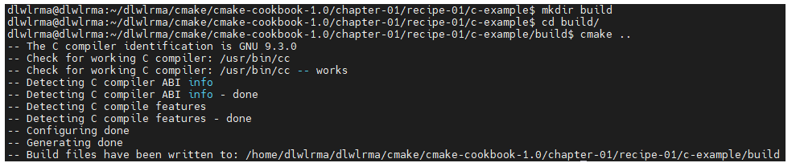

# 第一章、从可执行文件到库

## 1.1 将单个源文件编译为可执行文件

### 示例

```cmake
# set minimum cmake version
cmake_minimum_required(VERSION 3.5 FATAL_ERROR)

# project name and language
project(recipe-01 LANGUAGES C)

add_executable(hello-world hello-world.c)

```

```cmake
cmake_minimum_required(VERSION 3.5 FATAL_ERROR)
```

设置 `CMake` 所需的最低版本，如果使用的版本低于该版本，则会发出致命错误；

```cmake
project(recipe-01 LANGUAGES C)
```

声明了项目的名称和所支持的编程语言（CXX代表C++）

```cmake
add_executable(hello-world hello-world.c)
```

通过编译和连接源文件生产可执行文件 `hello-world`

Note：

> `CMake` 语言不区分大小写，但是参数区分大小写；
>
> `CMakeLists.txt` 不能命名为其他，将其放在与源文件相同的目录下

### 构建

```cmake
mkdir build
cd build/
cmake ..
cmake --build .
```



```
mkdir build
cd build/
cmake ..
```

创建了一个目录 `build` ，通过指定 `CMakeLists.txt` 的位置来调用 `CMake` ；

可以使用下面的命令行来实现相同的效果：

```cmake
cmake -H. -Bbuild
```

`-H` 表示在当前目录中搜索 `CMakeLists.txt` ， `-Bbuild` 告诉 `CMake`在一个名为 `build` 的目录中生产所有文件

>在与 `CMakeLists.txt` 相同的目录中执行 `cmake .`  ，足以配置一个项目，但是 `CMake `会将生成的所有文件写到项目的根目录中；

```
cmake --build .
```

构建项目

`CMake` 不强制指定构建目录执行的位置，完全可以把它放在项目路径之外

```cmake
mkdir -p /tmp/someplace
cd /tmp/someplace
cmake /path/to/source
cmake --build .
```


## 1.2 切换生成器

在使用 `CMake` 时显示的用 `-G` 切换生成器

```cmake
mkdir build
cd build/
cmake -G Ninja ..
```


## 1.3 构建和链接静态库和动态库

假设现在项目有这些文件

```
hello-world.cpp
Message.cpp
Message.hpp		//Message类提供给hello-world.cpp 使用
```

此时需要将 `Message` 编译成一个库，而不是直接编译成可执行文件

```cmake
add_library(message STATIC Message.hpp Message.cpp)
```

创建一个静态库，库的名称与源码文件名相同；第一个参数是目标名，实际生成的库文件名称将有 `CMake` 添加前缀lib和扩展名；生成库是根据第二个参数（`STATIC` 、`SHARED` 、`OBJECT` 、`MODULE` ）和操作系统决定的；

>`STATIC` ：创建静态库
>
>`SHARED` ：创建动态库，可以动态链接并在运行时加载
>
>`OBJECT` ：将给定 `add_library` 列表中的源码编译到目标文件，不讲他们归档到静态库或动态库；
>
>`MODULE` ：不链接到项目中的任何目标，不过可以进行动态加载；

```cmake
target_link_libraries(hello-world message)
```

将目标库链接到可执行文件上

完整 `CMakeLists.txt`

```cmake
# set minimum cmake version
cmake_minimum_required(VERSION 3.5 FATAL_ERROR)

# project name and language
project(recipe-01 LANGUAGES C)

add_library(message STATIC Message.hpp Message.cpp)
add_executable(hello-world hello-world.c)
target_link_libraries(hello-world message)
```


## 1.4 用条件语句控制编译

完整 `CMakeLists.txt`

```cmake
# set minimum cmake version
cmake_minimum_required(VERSION 3.5 FATAL_ERROR)

# project name and language
project(recipe-04 LANGUAGES CXX)

# introduce a toggle for using a library
set(USE_LIBRARY OFF)	//引入新变量USE_LIBRARY,值为OFF

message(STATUS "Compile sources into a library? ${USE_LIBRARY}")	//打印消息

# BUILD_SHARED_LIBS is a global flag offered by CMake
# to toggle the behavior of add_library
set(BUILD_SHARED_LIBS OFF)	//CMake中的一个全局变量，设置为OFF, 调用add_library可以省略第二个参数

# list sources
list(APPEND _sources Message.hpp Message.cpp)	// _source是一个局部变量

if(USE_LIBRARY)
  # add_library will create a static library
  # since BUILD_SHARED_LIBS is OFF
  add_library(message ${_sources})

  add_executable(hello-world hello-world.cpp)

  target_link_libraries(hello-world message)
else()
  add_executable(hello-world hello-world.cpp ${_sources})
endif()

```

将逻辑变量设为一下的任意一种：`1` 、`ON` 、`YES` 、`true` 、`Y` 或非零数，则逻辑变量为`true`

将逻辑变量设为一下的任意一种：`0`、`OFF`、`NO`、`false`、`N`、`IGNORE`、`NOTFOUND`、空字符串，或者以`-NOTFOUND`为后缀，则逻辑变量为`false`

`BUILD_SHARED_LIBS`变量如果为`ON`，则`add_library`默认创建共享库

>`message()`函数：为用户显示一条消息
>
>`message(STATUS "message to display")`
>
>可选的`STATUS`关键字：
>
>> * （无） = 重要消息
>>
>> * `STATUS` = 非重要消息
>>
>> * `WARNING` = `CMake`警告，会继续执行
>>
>> * `AUTHOR_WORNING` = `CMake`警告（`dev`），会继续执行
>>
>> * `SENG_ERROR` = `CMake`错误，继续执行，但是会跳过生成的步骤
>>
>> * `FATAL_ERROR` = `CMake`错误，终止所有处理过程
>>
>>   

> `list()`函数：一些列表操作
>
> * list(LENGTH <list><output variable>)
>
> * list(GET <list> <elementindex> [<element index> ...] <output variable>)
>
> * list(APPEND <list><element> [<element> ...])
>
> * list(FIND <list> <value><output variable>)
>
> * list(INSERT <list><element_index> <element> [<element> ...])
>
> * list(REMOVE_ITEM <list> <value>[<value> ...])
>
> * list(REMOVE_AT <list><index> [<index> ...])
>
> * list(REMOVE_DUPLICATES <list>)
>
> * list(REVERSE <list>)
>
> * list(SORT <list>)
>
>   > * LENGTH返回列表的长度
>   >
>   > * GET返回列表中指定下标的元素
>   > * APPEND添加新元素到列表中
>   > * INSERT 将新元素插入到列表中指定的位置
>   > * REMOVE_ITEM从列表中删除某个元素
>   > * REMOVE_AT从列表中删除指定下标的元素
>   > * REMOVE_DUPLICATES从列表中删除重复的元素
>   > * REVERSE 将列表的内容实地反转，改变的是列表本身，而不是其副本
>   > * SORT 将列表按字母顺序实地排序，改变的是列表本身，而不是其副本
>   >   