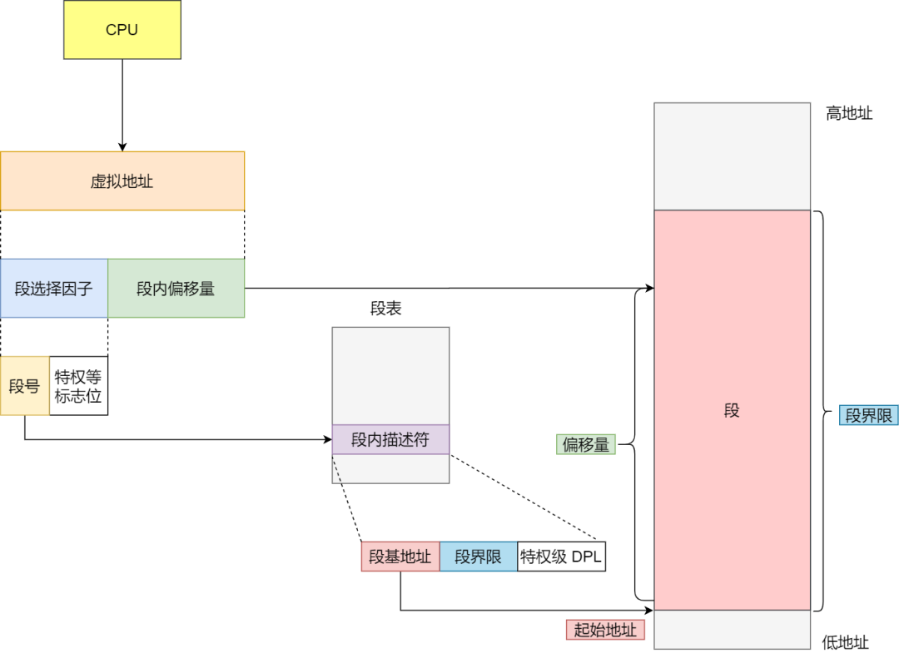
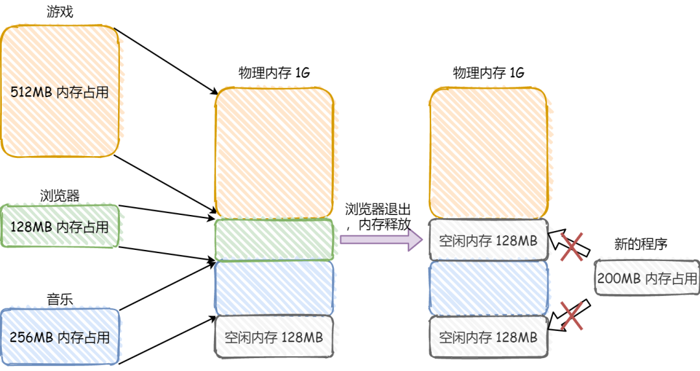
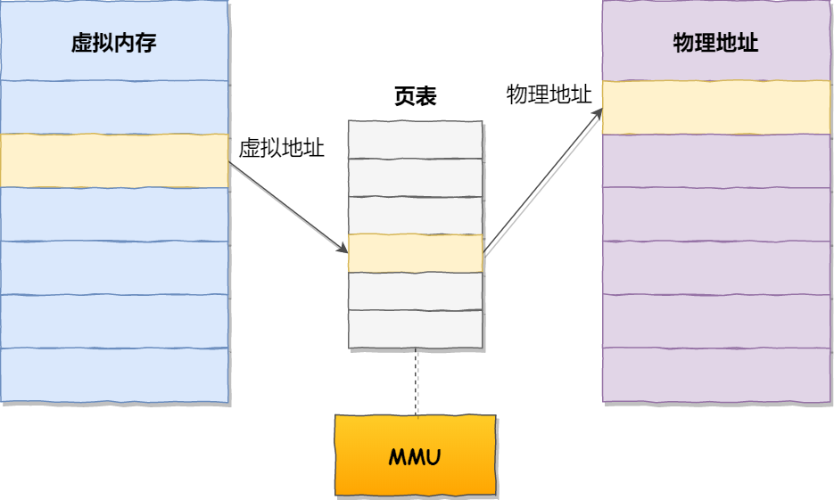

# 内存管理

> 原文链接
>
> https://mp.weixin.qq.com/s/HJB_ATQFNqG82YBCRr97CA

## 虚拟内存

### 为什么要有虚拟内存

以单片机为例。

单片机是没有操作系统的，所以每次写完代码，都需要借助工具把程序烧录进去，这样程序才能跑起来。

另外，**单片机的 CPU 是直接操作内存的「物理地址」**。

在这种情况下，**要想在内存中同时运行两个程序是不可能的**。如果第一个程序在 2000 的位置写入一个新的值，将会擦掉第二个程序存放在相同位置上的所有内容，所以同时运行两个程序是根本行不通的，这两个程序会立刻崩溃。

### 虚拟内存解决了什么问题

这里关键的问题是这两个程序都引用了**绝对物理地址**，而这正是我们最需要避免的。

我们可以把进程所使用的地址「**隔离**」开来，即让操作系统为每个进程分配独立的一套「**虚拟地址**」，互不干涉。

**操作系统会提供一种机制，将不同进程的虚拟地址和不同内存的物理地址映射起来。**

如果程序要访问虚拟地址的时候，由操作系统转换成不同的物理地址，这样不同的进程运行的时候，写入的是不同的物理地址，这样就不会冲突了。

于是，这里就引出了两种地址的概念：

- 我们程序所使用的内存地址叫做**虚拟内存地址**（*Virtual Memory Address*）
- 实际存在硬件里面的空间地址叫**物理内存地址**（*Physical Memory Address*）。

操作系统引入了虚拟内存，进程持有的虚拟地址会通过 CPU 芯片中的内存管理单元（*Memory Management Unit*）的映射关系，来转换变成物理地址，然后再通过物理地址访问内存，如下图所示：

> 操作系统是如何管理虚拟地址与物理地址之间的关系？

主要有两种方式，分别是**内存分段和内存分页**。

## 内存分段

程序是由若干个逻辑分段组成的，如可由代码分段、数据分段、栈段、堆段组成。**不同的段是有不同的属性的，所以就用分段（*Segmentation*）的形式把这些段分离出来。**

### 虚拟地址和物理地址如何映射？

分段机制下的虚拟地址由两部分组成，**段选择子**和**段内偏移量**。

- **段选择子**就保存在段寄存器里面。段选择子里面最重要的是**段号**，用作段表的索引。**段表**里面保存的是这个**段的基地址、段的界限和特权等级**等。
- 虚拟地址中的**段内偏移量**应该位于 0 和段界限之间，如果段内偏移量是合法的，就将段基地址加上段内偏移量得到物理内存地址。

虚拟地址是通过**段表**与物理地址进行映射的，分段机制会把程序的虚拟地址分成 4 个段，每个段在段表中有一个项，在这一项找到段的基地址，再加上偏移量，于是就能找到物理内存中的地址，如下图：

如果要访问段 3 中偏移量 500 的虚拟地址，我们可以计算出物理地址为，段 3 基地址 7000 + 偏移量 500 = 7500。

分段的办法很好，解决了程序本身不需要关心具体的物理内存地址的问题，但它也有一些不足之处：

- 第一个就是**内存碎片**的问题。
- 第二个就是**内存交换的效率低**的问题。

### 问题一：内存碎片

我们来看看这样一个例子。假设有 1G 的物理内存，用户执行了多个程序，其中：

- 游戏占用了 512MB 内存
- 浏览器占用了 128MB 内存
- 音乐占用了 256 MB 内存。

这个时候，如果我们关闭了浏览器，则空闲内存还有 1024 - 512 - 256 = 256MB。

如果这个 256MB 不是连续的，被分成了两段 128 MB 内存，这就会导致没有空间再打开一个 200MB 的程序。

这里的内存碎片的问题共有两处地方：

- 外部内存碎片，也就是产生了多个不连续的小物理内存，导致新的程序无法被装载；
- 内部内存碎片，程序所有的内存都被装载到了物理内存，但是这个程序有部分的内存可能并不是很常使用，这也会导致内存的浪费；

针对上面两种内存碎片的问题，解决的方式会有所不同。

#### 内存交换

解决外部内存碎片的问题就是**内存交换**。

可以把音乐程序占用的那 256MB 内存写到硬盘上，然后再从硬盘上读回来到内存里。不过再读回的时候，我们不能装载回原来的位置，而是紧紧跟着那已经被占用了的 512MB 内存后面。这样就能空缺出连续的 256MB 空间，于是新的 200MB 程序就可以装载进来。

这个内存交换空间，在 Linux 系统里，也就是我们常看到的 Swap 空间，这块空间是从硬盘划分出来的，用于内存与硬盘的空间交换。

### 问题二：内存交换效率低

对于多进程的系统来说，用分段的方式，内存碎片是很容易产生的，产生了内存碎片，那不得不重新 `Swap` 内存区域，这个过程会产生性能瓶颈。

因为硬盘的访问速度要比内存慢太多了，每一次内存交换，我们都需要把一大段连续的内存数据写到硬盘上。

所以，**如果内存交换的时候，交换的是一个占内存空间很大的程序，这样整个机器都会显得卡顿。**

为了解决内存分段的内存碎片和内存交换效率低的问题，就出现了内存分页。

## 内存分页

分段的好处就是能产生连续的内存空间，但是会出现内存碎片和内存交换的空间太大的问题。

要解决这些问题，那么就要想出能少出现一些内存碎片的办法。另外，当需要进行内存交换的时候，让需要交换写入或者从磁盘装载的数据更少一点，这样就可以解决问题了。这个办法，也就是**内存分页**（*Paging*）。

**分页是把整个虚拟和物理内存空间切成一段段固定尺寸的大小**。这样一个连续并且尺寸固定的内存空间，我们叫**页**（*Page*）。在 Linux 下，每一页的大小为 `4KB`。

虚拟地址与物理地址之间通过**页表**来映射，如下图：

⻚表是存储在内存⾥的，**内存管理单元** （*MMU*）就做将虚拟内存地址转换成物理地址的⼯作。

而当进程访问的虚拟地址在页表中查不到时，系统会产生一个**缺页异常**，进入系统内核空间分配物理内存、更新进程页表，最后再返回用户空间，恢复进程的运行。

### 如何解决分段出现的问题

由于内存空间都是预先划分好的，也就不会像分段会产⽣间隙⾮常⼩的内存，这正是分段会产⽣内存碎⽚

的原因。⽽**采⽤了分⻚，那么释放的内存都是以⻚为单位释放的，也就不会产⽣⽆法给进程使⽤的⼩内**

**存。**

如果内存空间不够，操作系统会把其他正在运⾏的进程中的「最近没被使⽤」的内存⻚⾯给释放掉，也就

是暂时写在硬盘上，称为**换出**（*Swap Out*）。⼀旦需要的时候，再加载进来，称为**换⼊**（*Swap In*）。所

以，⼀次性写⼊磁盘的也只有少数的⼀个⻚或者⼏个⻚，不会花太多时间，**内存交换的效率就相对⽐较**

**⾼。**