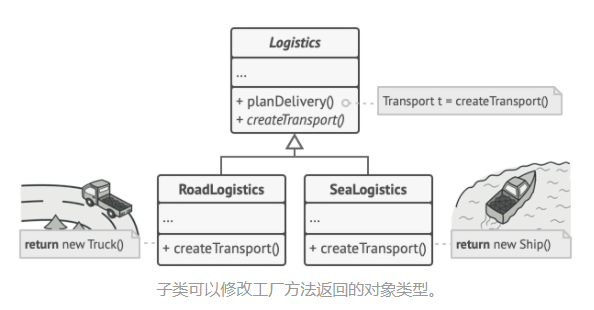
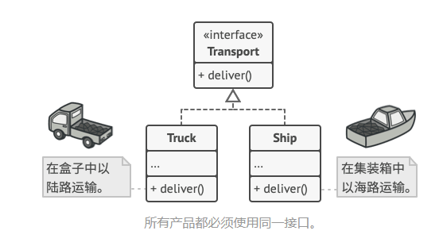
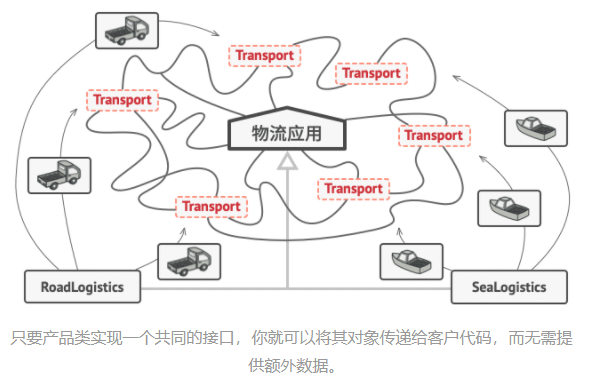

# 工厂方法模式

## 意图

工厂方法模式是一种创建型设计模式， 其<font color=red>**在父类中提供一个创建对象的方法， 允许子类决定实例化对象的类型**</font>。

## 问题

假设你正在开发一款物流管理应用。 最初版本只能处理卡车运输， 因此大部分代码都在位于名为 `卡车`的类中。

一段时间后， 这款应用变得极受欢迎。 你每天都能收到十几次来自海运公司的请求， 希望应用能够支持海上物流功能。


这可是个好消息。 但是代码问题该如何处理呢？ 目前， 大部分代码都与 `卡车`类相关。 在程序中添加 `轮船`类需要修改全部代码。 更糟糕的是， 如果你以后需要在程序中支持另外一种运输方式， 很可能需要再次对这些代码进行大幅修改。

最后， 你将不得不编写繁复的代码， 根据不同的运输对象类， 在应用中进行不同的处理。

## 解决方案

工厂方法模式建议使用特殊的工厂方法代替对于对象构造函数的直接调用 （即使用 `new`运算符）。 不用担心， 对象仍将通过 `new`运算符创建， 只是该运算符改在工厂方法中调用罢了。 工厂方法返回的对象通常被称作 “产品”。



乍看之下， 这种更改可能毫无意义： 我们只是改变了程序中调用构造函数的位置而已。 但是， 仔细想一下， 现在<font color=red>**你可以在子类中重写工厂方法， 从而改变其创建产品的类型**</font>。

但有一点需要注意:<font color=red>**仅当这些产品具有共同的基类或者接口时， 子类才能返回不同类型的产品， 同时基类中的工厂方法还应将其返回类型声明为这一共有接口**</font>。



举例来说，  `卡车Truck` 和 `轮船Ship` 类都必须实现 `运输Transport` 接口， 该接口声明了一个名为 `deliver`交付的方法。 每个类都将以不同的方式实现该方法： 卡车走陆路交付货物， 轮船走海路交付货物。  `陆路运输Road­Logistics` 类中的工厂方法返回卡车对象， 而 `海路运输Sea­Logistics` 类则返回轮船对象。



调用工厂方法的代码 （通常被称为客户端代码） 无需了解不同子类返回实际对象之间的差别。 客户端将所有产品视为抽象的 `运输` 。 客户端知道所有运输对象都提供 `交付`方法， 但是并不关心其具体实现方式。

## 工厂方法模式结构


## 代码示例

```c++
//
// Created by huangshibin on 2021/4/6.
//
#include <string>
#include <iostream>

/**
 * The Product interface declares the operations that all concrete products must
 * implement.
 */

class Product {
public:
    virtual ~Product() {}
    virtual std::string Operation() const = 0;
};

/**
 * Concrete Products provide various implementations of the Product interface.
 */
class ConcreteProduct1 : public Product {
public:
    std::string Operation() const override {
        return "{Result of the ConcreteProduct1}";
    }
};
class ConcreteProduct2 : public Product {
public:
    std::string Operation() const override {
        return "{Result of the ConcreteProduct2}";
    }
};

/**
 * The Creator class declares the factory method that is supposed to return an
 * object of a Product class. The Creator's subclasses usually provide the
 * implementation of this method.
 */

class Creator {
    /**
     * Note that the Creator may also provide some default implementation of the
     * factory method.
     */
public:
    virtual ~Creator(){};
    virtual Product* FactoryMethod() const = 0;
    /**
     * Also note that, despite its name, the Creator's primary responsibility is
     * not creating products. Usually, it contains some core business logic that
     * relies on Product objects, returned by the factory method. Subclasses can
     * indirectly change that business logic by overriding the factory method and
     * returning a different type of product from it.
     */

    std::string SomeOperation() const {
        // Call the factory method to create a Product object.
        Product* product = this->FactoryMethod();
        // Now, use the product.
        std::string result = "Creator: The same creator's code has just worked with " + product->Operation();
        delete product;
        return result;
    }
};

/**
 * Concrete Creators override the factory method in order to change the
 * resulting product's type.
 */
class ConcreteCreator1 : public Creator {
    /**
     * Note that the signature of the method still uses the abstract product type,
     * even though the concrete product is actually returned from the method. This
     * way the Creator can stay independent of concrete product classes.
     */
public:
    Product* FactoryMethod() const override {
        return new ConcreteProduct1();
    }
};

class ConcreteCreator2 : public Creator {
public:
    Product* FactoryMethod() const override {
        return new ConcreteProduct2();
    }
};

/**
 * The client code works with an instance of a concrete creator, albeit through
 * its base interface. As long as the client keeps working with the creator via
 * the base interface, you can pass it any creator's subclass.
 */
void ClientCode(const Creator& creator) {
    // ...
    std::cout << "Client: I'm not aware of the creator's class, but it still works.\n"
              << creator.SomeOperation() << std::endl;
    // ...
}

/**
 * The Application picks a creator's type depending on the configuration or
 * environment.
 */

int main() {
    std::cout << "App: Launched with the ConcreteCreator1.\n";
    Creator* creator = new ConcreteCreator1();
    ClientCode(*creator);
    std::cout << std::endl;
    std::cout << "App: Launched with the ConcreteCreator2.\n";
    Creator* creator2 = new ConcreteCreator2();
    ClientCode(*creator2);

    delete creator;
    delete creator2;
    return 0;
}

/**
 * Output:
 * App: Launched with the ConcreteCreator1.
 * Client: I'm not aware of the creator's class, but it still works.
 * Creator: The same creator's code has just worked with {Result of the ConcreteProduct1}
 *
 * App: Launched with the ConcreteCreator2.
 * Client: I'm not aware of the creator's class, but it still works.
 * Creator: The same creator's code has just worked with {Result of the ConcreteProduct2}
 */
```

在示例代码中父类所提供的创建对象的方法即 `Creator.FactoryMethod`

而子类所重写的创建对象的方法即 `ConcreteCreator1.FactoryMethod` 、 `ConcreteCreator2.FactoryMethod`

> 调用工厂方法的代码 （通常被称为客户端代码） 无需了解不同子类返回实际对象之间的差别。 客户端将所有产品视为抽象的 `运输` 。 客户端知道所有运输对象都提供 `交付`方法， 但是并不关心其具体实现方式。

## 工厂方法模式适合应用场景

- 如果无法预知对象确切类别及其依赖关系时，可使用工厂方法；

  >工厂方法将创建产品的代码与实际使用产品的代码分离， 从而能在不影响其他代码的情况下扩展产品创建部分代码。
  >
  >例如， 如果需要向应用中添加一种新产品， 你只需要开发新的创建者子类， 然后重写其工厂方法即可。

- 如果你希望用户能扩展你软件库或框架的内部组件，可使用工厂方法;

  >继承可能是扩展软件库或框架默认行为的最简单方法。 但是当你使用子类替代标准组件时， 框架如何辨识出该子类？
  >
  >解决方案是将各框架中构造组件的代码集中到单个工厂方法中， 并在继承该组件之外允许任何人对该方法进行重写。

- 如果你希望复用现有对象来节省系统资源，而不是每次都重新创建对象，可使用工厂方法;

  > 让我们思考复用现有对象的方法：
  >
  > 1. 首先， 你需要创建存储空间来存放所有已经创建的对象。
  > 2. 当他人请求一个对象时， 程序将在对象池中搜索可用对象。
  > 3. …然后将其返回给客户端代码。
  > 4. 如果没有可用对象， 程序则创建一个新对象 （并将其添加到对象池中）。
  >
  > 这些代码可不少！ 而且它们必须位于同一处， 这样才能确保重复代码不会污染程序。
  >
  > 可能最显而易见， 也是最方便的方式， 就是将这些代码放置在我们试图重用的对象类的构造函数中。 但是从定义上来讲， 构造函数始终返回的是**新对象**， 其无法返回现有实例。
  >
  > 因此， 你需要有一个既能够创建新对象， 又可以重用现有对象的普通方法。 这听上去和工厂方法非常相像。

## 实现方法

1. 让**所有产品都遵循同一接口**。 该接口必须声明**对所有产品都有意义的方法**。

2. 在创建类中添加一个空的工厂方法。 **该方法的返回类型必须遵循通用的产品接口**。

3. 在创建者代码中找到对于产品构造函数的所有引用。 将它们依次替换为对于工厂方法的调用， 同时将创建产品的代码移入工厂方法。 你可能需要在工厂方法中添加临时参数来控制返回的产品类型。

   工厂方法的代码看上去可能非常糟糕。 其中可能会有复杂的 `switch`分支运算符， 用于选择各种需要实例化的产品类。 但是不要担心， 我们很快就会修复这个问题。

4. 现在， 为工厂方法中的每种产品编写一个创建者子类， 然后在子类中重写工厂方法， 并将基本方法中的相关创建代码移动到工厂方法中。

5. 如果应用中的产品类型太多， 那么为每个产品创建子类并无太大必要， 这时你也可以在子类中复用基类中的控制参数。

   例如， 设想你有以下一些层次结构的类。 基类 `邮件`及其子类 `航空邮件`和 `陆路邮件` ；  `运输`及其子类 `飞机`, `卡车`和 `火车` 。  `航空邮件`仅使用 `飞机`对象， 而 `陆路邮件`则会同时使用 `卡车`和 `火车`对象。 你可以编写一个新的子类 （例如 `火车邮件` ） 来处理这两种情况， 但是还有其他可选的方案。 客户端代码可以给 `陆路邮件`类传递一个参数， 用于控制其希望获得的产品。

6. 如果代码经过上述移动后， 基础工厂方法中已经没有任何代码， 你可以将其转变为抽象类。 如果基础工厂方法中还有其他语句， 你可以将其设置为该方法的默认行为。

## 工厂方法模式优缺点

&#x2713; 你可以**避免创建者和具体产品之间的紧密耦合**。

&#x2713; **单一职责原则**。 你可以将产品创建代码放在程序的单一位置， 从而使得代码更容易维护。

&#x2713; **开闭原则**。 无需更改现有客户端代码， 你就可以在程序中引入新的产品类型。

&#x2718; 应用工厂方法模式需要引入许多新的子类， 代码可能会因此变得更复杂。 最好的情况是将该模式引入创建者类	的现有层次结构中。

## 与其他模式的关系

- 在许多设计工作的初期都会使用[工厂方法模式](https://refactoringguru.cn/design-patterns/factory-method) （较为简单， 而且可以更方便地通过子类进行定制）， 随后演化为使用[抽象工厂模式](https://refactoringguru.cn/design-patterns/abstract-factory)、 [原型模式](https://refactoringguru.cn/design-patterns/prototype)或[生成器模式](https://refactoringguru.cn/design-patterns/builder) （更灵活但更加复杂）。
- [抽象工厂模式](https://refactoringguru.cn/design-patterns/abstract-factory)通常基于一组[工厂方法](https://refactoringguru.cn/design-patterns/factory-method)， 但你也可以使用[原型模式](https://refactoringguru.cn/design-patterns/prototype)来生成这些类的方法。
- 你可以同时使用[工厂方法](https://refactoringguru.cn/design-patterns/factory-method)和[迭代器模式](https://refactoringguru.cn/design-patterns/iterator)来让子类集合返回不同类型的迭代器， 并使得迭代器与集合相匹配。
- [原型](https://refactoringguru.cn/design-patterns/prototype)并不基于继承， 因此没有继承的缺点。 另一方面， 原型需要对被复制对象进行复杂的初始化。 [工厂方法](https://refactoringguru.cn/design-patterns/factory-method)基于继承， 但是它不需要初始化步骤。
- [工厂方法](https://refactoringguru.cn/design-patterns/factory-method)是[模板方法模式](https://refactoringguru.cn/design-patterns/template-method)的一种特殊形式。 同时， 工厂方法可以作为一个大型模板方法中的一个步骤。